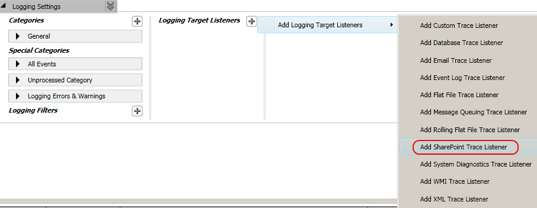
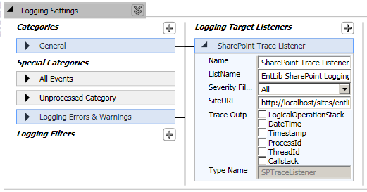
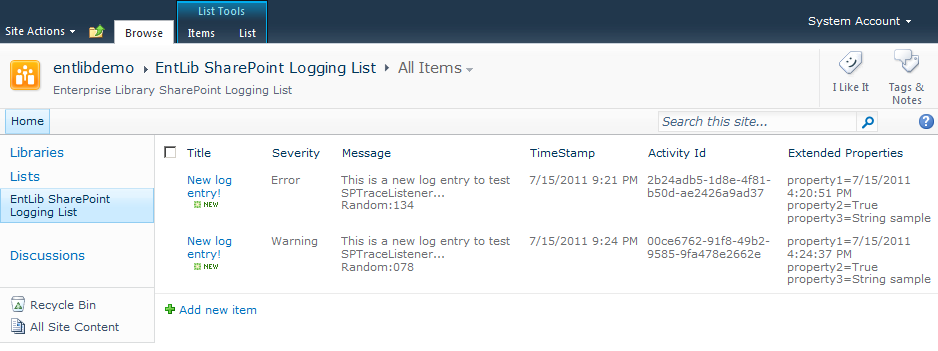
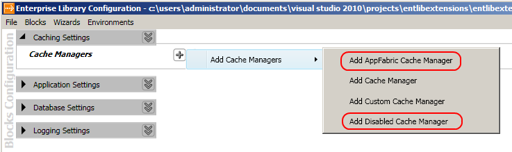
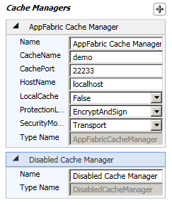
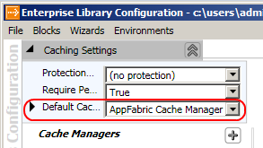
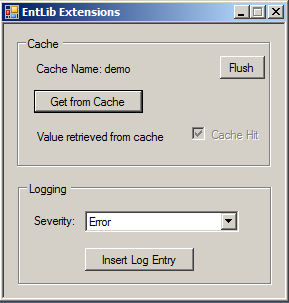
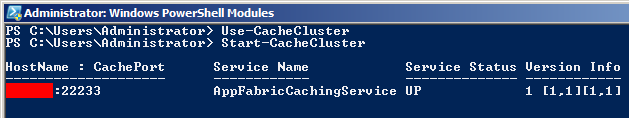

# Enterprise Library Extensions

## Project Description
Extensions for Enterprise Library 5 that include:

* SharePoint 2010 Logging Trace Listener.
* Cache Provider for Windows Server AppFabric.
* Disabled Cache Provider.

The usage of this tools assumes that you know how to install SharePoint packages, activate features, use Windows Server AppFabric caching, ... There are lots of tutorials out there, so please refer to them should you need any guidance. This is just a compilation of code to enhance these already amazing tools, which you can freely use and modify (please add a reference to this site if you do so) to suit your needs. It's not bullet-proof, so use at your own risk, but I've decided to upload it as-is so the community can check it out (since you also will have the source code).

Just reference the _EntLibExtensions.dll_ file from within your project and you can start usign it right away. You'll need references to SharePoint and Enterprise Library too, of course.
In the solution these are referenced from my local folder _C:\Users\Administrator\Documents\Visual Studio 2010\Projects\EntLibExtensions\LIB_, so please go ahead and grab latest version of these tools before attempting to run this code.

If you want to use Enterprise Library configuration console integration, please copy the compiled _EntLibExtensions.dll_ also to the bin folder where the console is installed (by default C:\Program Files (x86)\Microsoft Enterprise Library 5.0\Bin). This way you'll be able to use the GUI to edit the configuration.

### Integration update
If using Windows Server AppFabric version 1.1 instead of 1.0, as per the release notes [http://msdn.microsoft.com/en-us/library/hh361710.aspx](http://msdn.microsoft.com/en-us/library/hh361710.aspx) now the caching DLLs are **NOT** registered in the GAC upon installation, so you would need to either GAC or copy the following DLLs to the console folder:

* Microsoft.ApplicationServer.Caching.Client.dll
* Microsoft.ApplicationServer.Caching.Core.dll

## Logging Trace Listeners

### SharePoint Trace Listener
New trace listener to dump logging information to a SharePoint 2010 list.

A new site feature (EntLibSPLogging) is included to create an instance of the logging list schema upon activation:

Select _Add SharePoint Trace Listener_ in your logging configuration block:

Specify your settings (mainly list name and site URL):

After you log something you'll be able to see the results in the target list:

## Cache Managers

### Disabled Cache Manager
Dummy cache provider to just "disable" caching behavior.

### AppFabric Cache Manager
New provider to use Windows Server AppFabric ([http://msdn.microsoft.com/en-us/windowsserver/ee695849](http://msdn.microsoft.com/en-us/windowsserver/ee695849)) caching capabilities.

It uses the following DLLs:
* Microsoft.ApplicationServer.Caching.Client.dll
* Microsoft.ApplicationServer.Caching.Core.dll

In Enterprise Library 5 configuration console, just click the + symbol next to _Cache Managers_ after adding the corresponding block:

Configure it with the desired values (local caching uses default values, haven't implemented configuration yet):

Next make sure you select the default cache manager from the ones you added to the configuration:

There's a sample application included to test funcionality:

Of course, please make sure the corresponding cache cluster is running before using this code:

You can download the compiled binaries here:

[http://blog.gamosoft.com/enterprise-library-extensions/](http://blog.gamosoft.com/enterprise-library-extensions/)

I hope you guys like it and can use it. :-)
Kind regards.